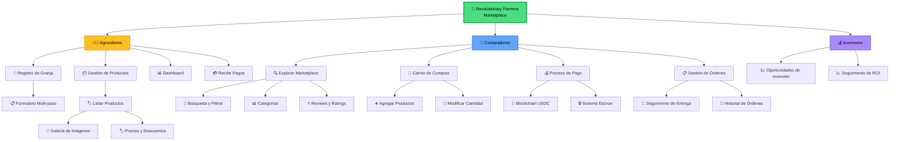

# Funcionalidades Generales - Revolutionary Farmers Marketplace

Este diagrama muestra una vista general de todas las funcionalidades principales del Revolutionary Farmers Marketplace, organizada por tipos de usuario.

## Descripción de Funcionalidades

### 👨‍🌾 Agricultores
- **Registro de Granja**: Proceso completo de onboarding con verificación
- **Gestión de Productos**: CRUD completo de productos agrícolas
- **Dashboard**: Panel de control con métricas y gestión
- **Recibir Pagos**: Sistema automatizado de pagos vía blockchain

### 🛒 Compradores
- **Explorar Marketplace**: Navegación y descubrimiento de productos
- **Carrito de Compras**: Gestión de productos seleccionados
- **Proceso de Pago**: Checkout seguro con múltiples métodos
- **Gestión de Órdenes**: Seguimiento y historial de compras

### 💰 Inversores
- **Oportunidades de Inversión**: Proyectos agrícolas disponibles
- **Seguimiento de ROI**: Monitoreo de retorno de inversión 