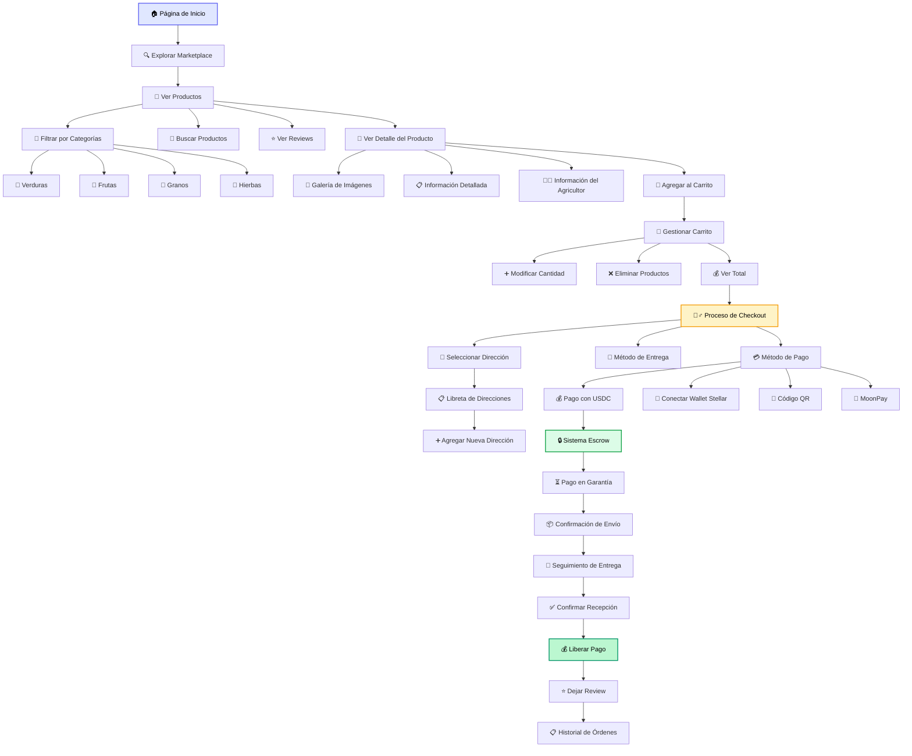

# Flujo de Usuario Comprador

Este diagrama detalla todo el journey del usuario comprador desde el descubrimiento hasta la finalización de la compra.

## Descripción del Flujo

### 🔍 Descubrimiento
- **Exploración**: Navegación libre por el marketplace
- **Filtros**: Búsqueda por categorías, precios, métodos de cultivo
- **Reviews**: Sistema de calificaciones y comentarios

### 🛒 Selección
- **Detalle del Producto**: Información completa con galería
- **Carrito**: Gestión flexible de productos seleccionados
- **Comparación**: Evaluación entre diferentes opciones

### 💳 Compra
- **Checkout Seguro**: Proceso simplificado en múltiples pasos
- **Pagos Flexibles**: USDC, wallet Stellar, QR, MoonPay
- **Escrow**: Protección automática de fondos

### 📦 Seguimiento
- **Transparencia**: Seguimiento en tiempo real
- **Confirmación**: Proceso de verificación de entrega
- **Feedback**: Sistema de reviews post-compra 