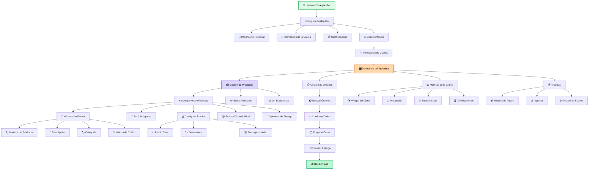

# Flujo de Usuario Agricultor

Este diagrama muestra el proceso completo que sigue un agricultor desde el registro hasta la gestión de su negocio en la plataforma.

## Descripción del Flujo

### 📝 Onboarding
- **Registro Multi-paso**: Proceso completo de verificación
- **Documentación**: Certificaciones y pruebas de legitimidad
- **Verificación**: Proceso de aprobación manual

### 📦 Gestión de Productos
- **CRUD Completo**: Crear, leer, actualizar y eliminar productos
- **Rich Media**: Múltiples imágenes y descripciones detalladas
- **Pricing Flexible**: Descuentos, promociones y pricing dinámico

### 📊 Analytics y Métricas
- **Performance**: Seguimiento de ventas y engagement
- **Weather Integration**: Datos climáticos en tiempo real
- **Sustainability**: Métricas de impacto ambiental

### 💰 Gestión Financiera
- **Pagos Automáticos**: Recepción de pagos vía blockchain
- **Escrow Management**: Control sobre transacciones en garantía
- **Reporting**: Informes detallados de ingresos 