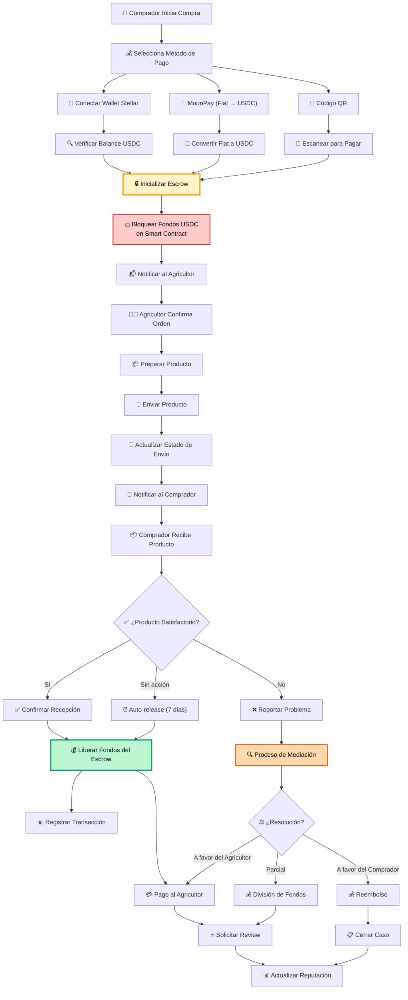

# Sistema de Escrow y Transacciones Blockchain

Este diagrama detalla el flujo completo de transacciones blockchain utilizando el sistema de escrow para garantizar la seguridad de compradores y vendedores.

## Operaciones del Sistema de Escrow

### 🔒 Operaciones Principales
1. **Initialize Escrow**: Crear nuevo contrato de garantía
2. **Fund Escrow**: Depositar fondos USDC en el contrato
3. **Complete Escrow**: Liberar fondos al vendedor
4. **Cancel Escrow**: Cancelar y reembolsar
5. **Claim Earnings**: Retirar ganancias acumuladas
6. **Refund Remaining**: Reembolsar fondos restantes
7. **Get Engagement**: Consultar estado del contrato

### 💰 Métodos de Pago
- **Wallet Stellar**: Conexión directa con Freighter u otros wallets
- **MoonPay**: Conversión de fiat (EUR, USD) a USDC
- **Código QR**: Pago mediante escaneo de código QR
- **Transferencia Directa**: USDC wallet-to-wallet

### 🔒 Seguridad y Garantías
- **Smart Contracts**: Código inmutable en Stellar blockchain
- **Timelock**: Auto-liberación después de 7 días sin disputa
- **Mediación**: Proceso de resolución de conflictos
- **Multi-firma**: Requiere aprobación de múltiples partes

### ⚖️ Resolución de Disputas
- **Automatizada**: Para casos simples con criterios claros
- **Manual**: Revisión humana para casos complejos
- **Transparente**: Historial completo de transacciones
- **Justa**: División proporcional de fondos cuando corresponde 