# Sistema de Gestión de Productos e Inventario

Este diagrama muestra el sistema completo de gestión de productos, desde la creación por parte de los agricultores hasta la visualización en el marketplace.

```mermaid
graph TB
    A["📦 Sistema de Gestión de Productos"] --> B["👨‍🌾 Panel del Agricultor"]
    A --> C["🛒 Marketplace Público"]
    
    B --> D["➕ Agregar Producto"]
    B --> E["✏️ Editar Producto"]
    B --> F["📊 Gestionar Inventario"]
    B --> G["📈 Analytics"]
    
    D --> D1["📝 ProductForm"]
    D1 --> D2["🏷️ Información Básica<br/>- Nombre<br/>- Descripción<br/>- Categoría"]
    D1 --> D3["📸 Galería de Imágenes<br/>- Imágenes principales<br/>- Imágenes adicionales<br/>- Fallback SVG"]
    D1 --> D4["💰 Configuración de Precios<br/>- Precio base<br/>- Descuentos<br/>- Precio por unidad"]
    D1 --> D5["📦 Stock y Disponibilidad<br/>- Cantidad disponible<br/>- Fecha de cosecha<br/>- Fecha de expiración"]
    D1 --> D6["🚚 Opciones de Entrega<br/>- Entrega a domicilio<br/>- Pickup disponible<br/>- Zonas de entrega"]
    D1 --> D7["🌱 Información Agrícola<br/>- Método de cultivo<br/>- Certificaciones<br/>- Origen"]
    
    C --> H["🔍 ProductGrid"]
    C --> I["🔎 ProductFilters"]
    C --> J["📱 ProductCard"]
    
    H --> H1["📱 Vista de Cuadrícula"]
    H --> H2["📋 Vista de Lista"]
    H --> H3["🔄 Paginación"]
    H --> H4["🔀 Ordenamiento"]
    
    I --> I1["🏷️ Filtro por Categoría<br/>- Verduras<br/>- Frutas<br/>- Granos<br/>- Hierbas"]
    I --> I2["🌱 Método de Cultivo<br/>- Orgánico<br/>- Tradicional<br/>- Hidropónico"]
    I --> I3["💰 Rango de Precios<br/>- Min/Max slider"]
    I --> I4["🚚 Opciones de Entrega<br/>- Solo entrega<br/>- Solo pickup"]
    I --> I5["🔍 Búsqueda por Texto"]
    
    J --> J1["📸 Imagen del Producto"]
    J --> J2["🏷️ Información Básica"]
    J --> J3["💰 Precio y Descuentos"]
    J --> J4["⭐ Rating y Reviews"]
    J --> J5["🛒 Botón Agregar al Carrito"]
    J --> J6["❤️ Agregar a Wishlist"]
    
    F --> K["📊 Stock Management"]
    K --> K1["📈 Niveles de Inventario"]
    K --> K2["⚠️ Alertas de Stock Bajo"]
    K --> K3["📅 Fechas de Expiración"]
    K --> K4["🔄 Restock Automático"]
    
    G --> L["📊 Product Analytics"]
    L --> L1["👀 Vistas del Producto"]
    L --> L2["🛒 Tasa de Conversión"]
    L --> L3["⭐ Ratings Promedio"]
    L --> L4["💰 Ingresos por Producto"]
    
    style A fill:#4ade80,stroke:#16a34a,stroke-width:3px,color:#000
    style B fill:#fbbf24,stroke:#f59e0b,stroke-width:2px,color:#000
    style C fill:#60a5fa,stroke:#3b82f6,stroke-width:2px,color:#000
    style J fill:#a78bfa,stroke:#8b5cf6,stroke-width:2px,color:#000
```

## Funcionalidades del Sistema

### 📦 Gestión de Productos (Agricultor)
- **CRUD Completo**: Crear, leer, actualizar y eliminar productos
- **Rich Content**: Múltiples imágenes, descripciones detalladas
- **Pricing Dinámico**: Descuentos automáticos y promociones
- **Inventory Tracking**: Seguimiento de stock en tiempo real

### 🛒 Marketplace (Público)
- **Product Discovery**: Sistema avanzado de búsqueda y filtros
- **Visual Layout**: Grilla responsiva con diferentes vistas
- **User Experience**: Interacciones fluidas y carga optimizada
- **Social Features**: Reviews, ratings y wishlist

### 🔍 Filtros y Búsqueda
- **Categorías**: Organización por tipo de producto
- **Métodos de Cultivo**: Filtro por prácticas agrícolas
- **Precios**: Rango de precios personalizable
- **Logística**: Filtros por opciones de entrega
- **Texto Libre**: Búsqueda semántica avanzada

### 📊 Analytics y Métricas
- **Performance**: Métricas de visualización y conversión
- **Inventory Intelligence**: Alertas automáticas de stock
- **Revenue Tracking**: Seguimiento de ingresos por producto
- **Customer Insights**: Análisis de comportamiento de compra

## Características Técnicas

### 🎨 UI/UX Features
- **Responsive Design**: Optimizado para todos los dispositivos
- **Lazy Loading**: Carga optimizada de imágenes
- **Skeleton Loading**: Estados de carga elegantes
- **Error Boundaries**: Manejo robusto de errores

### 🔄 Estado y Sincronización
- **Real-time Updates**: Sincronización en tiempo real
- **Optimistic UI**: Actualizaciones optimistas
- **Cache Management**: Gestión inteligente de caché
- **Offline Support**: Funcionalidad offline limitada 