# Sistema de Usuarios y Autenticación

Este diagrama muestra el sistema completo de gestión de usuarios, autenticación y perfiles en el Revolutionary Farmers Marketplace.

```mermaid
graph TB
    A["👤 Sistema de Usuarios<br/>Revolutionary Farmers"] --> B["🔐 Autenticación"]
    A --> C["👥 Tipos de Usuario"]
    A --> D["🎛️ Dashboard Personalizado"]
    
    B --> E["📝 Registro"]
    B --> F["🔑 Iniciar Sesión"]
    B --> G["🔒 Recuperar Contraseña"]
    B --> H["👛 Conexión Wallet"]
    
    E --> E1["📋 SignUpForm"]
    E1 --> E2["👤 Información Personal<br/>- Nombre<br/>- Email<br/>- Contraseña"]
    E1 --> E3["✅ Verificación Email"]
    E1 --> E4["👛 Conectar Wallet (Opcional)"]
    
    F --> F1["📋 SignInForm"]
    F1 --> F2["🔑 Email + Contraseña"]
    F1 --> F3["👛 Login con Wallet"]
    
    G --> G1["📋 ForgotPasswordForm"]
    G1 --> G2["📧 Enviar Email Reset"]
    G1 --> G3["🔑 Nueva Contraseña"]
    
    H --> H1["⭐ Freighter Wallet"]
    H --> H2["🔗 Stellar SDK"]
    H --> H3["💰 Verificar Balance USDC"]
    
    C --> I["🛒 Comprador"]
    C --> J["👨‍🌾 Agricultor"]
    C --> K["💰 Inversor"]
    C --> L["👨‍💼 Administrador"]
    
    I --> I1["🛒 Carrito Personal"]
    I --> I2["📍 Libro de Direcciones"]
    I --> I3["📋 Historial de Órdenes"]
    I --> I4["❤️ Lista de Deseos"]
    I --> I5["⭐ Reviews Realizadas"]
    
    J --> J1["🏠 Perfil de Granja"]
    J --> J2["📦 Gestión de Productos"]
    J --> J3["📊 Dashboard de Ventas"]
    J --> J4["💰 Gestión Financiera"]
    J --> J5["📬 Gestión de Órdenes"]
    J --> J6["🏆 Certificaciones"]
    
    K --> K1["💹 Portfolio de Inversiones"]
    K --> K2["📈 ROI Tracking"]
    K --> K3["🌱 Proyectos Disponibles"]
    
    L --> L1["👥 Gestión de Usuarios"]
    L --> L2["📊 Analytics Globales"]
    L --> L3["🔧 Configuración Sistema"]
    
    D --> M["🎨 Profile Settings"]
    M --> M1["👤 Información Personal"]
    M --> M2["🔐 Configuración Seguridad"]
    M --> M3["🌍 Preferencias de Idioma"]
    M --> M4["🔔 Notificaciones"]
    M --> M5["👛 Gestión de Wallets"]
    
    style A fill:#4ade80,stroke:#16a34a,stroke-width:3px,color:#000
    style B fill:#fbbf24,stroke:#f59e0b,stroke-width:2px,color:#000
    style I fill:#60a5fa,stroke:#3b82f6,stroke-width:2px,color:#000
    style J fill:#f97316,stroke:#ea580c,stroke-width:2px,color:#000
    style K fill:#a78bfa,stroke:#8b5cf6,stroke-width:2px,color:#000
    style L fill:#ef4444,stroke:#dc2626,stroke-width:2px,color:#000
```

## Funcionalidades por Tipo de Usuario

### 🛒 Comprador
**Funcionalidades Principales:**
- **Shopping Experience**: Carrito personalizado, wishlist, comparaciones
- **Address Management**: Múltiples direcciones de envío
- **Order Tracking**: Seguimiento completo de pedidos
- **Social Features**: Reviews, ratings, recomendaciones

**Dashboard Específico:**
- Resumen de compras recientes
- Estado de órdenes activas
- Productos guardados en wishlist
- Historial de transacciones

### 👨‍🌾 Agricultor
**Funcionalidades Principales:**
- **Farm Management**: Perfil completo de granja con certificaciones
- **Product Catalog**: CRUD completo de productos
- **Sales Analytics**: Métricas de ventas y performance
- **Financial Tools**: Gestión de pagos y escrow

**Dashboard Específico:**
- KPIs de ventas y productos
- Órdenes pendientes y en proceso
- Métricas de engagement del cliente
- Weather widget integrado

### 💰 Inversor
**Funcionalidades Principales:**
- **Investment Portfolio**: Seguimiento de inversiones activas
- **ROI Analytics**: Métricas de retorno de inversión
- **Project Discovery**: Exploración de nuevos proyectos

**Dashboard Específico:**
- Performance de portfolio
- Proyectos en los que ha invertido
- Nuevas oportunidades disponibles
- Reportes financieros

### 👨‍💼 Administrador
**Funcionalidades Principales:**
- **User Management**: Gestión completa de usuarios
- **Platform Analytics**: Métricas globales de la plataforma
- **System Configuration**: Configuración y mantenimiento

**Dashboard Específico:**
- KPIs globales de la plataforma
- Gestión de disputas
- Configuración de sistemas
- Monitoring y logs

## Sistema de Autenticación

### 🔐 Métodos de Autenticación
1. **Email/Password**: Método tradicional con verificación
2. **Wallet Connect**: Autenticación via Stellar wallet
3. **Social Login**: Futuro soporte para Google/Twitter
4. **2FA**: Autenticación de dos factores (planificado)

### 🔒 Seguridad
- **Password Hashing**: bcrypt con salt
- **JWT Tokens**: Tokens seguros con expiración
- **Wallet Signature**: Verificación criptográfica
- **Rate Limiting**: Protección contra ataques

### 📱 Gestión de Sesiones
- **Multi-device**: Sesiones en múltiples dispositivos
- **Auto-logout**: Cierre automático por inactividad
- **Device Management**: Control de dispositivos activos

## Perfiles y Configuración

### 👤 Información Personal
- Datos básicos del usuario
- Foto de perfil y biografía
- Información de contacto
- Preferencias de privacidad

### 🌍 Configuración Regional
- Selección de idioma (ES/EN)
- Zona horaria
- Moneda preferida
- Formato de fecha/hora

### 🔔 Notificaciones
- Email notifications
- Push notifications (futuro)
- In-app notifications
- Configuración granular de alertas 