# General Features - Revolutionary Farmers Marketplace

This diagram shows a general overview of all the main features of the Revolutionary Farmers Marketplace, organized by user types.

```mermaid
graph TD
    A["🌱 Revolutionary Farmers<br/>Marketplace"] --> B["👨‍🌾 Farmers"]
    A --> C["🛒 Buyers"] 
    A --> D["💰 Investors"]
    
    B --> E["📝 Farm Registration"]
    B --> F["📦 Product Management"]
    B --> G["📊 Dashboard"]
    B --> H["💳 Receive Payments"]
    
    C --> I["🔍 Explore Marketplace"]
    C --> J["🛒 Shopping Cart"]
    C --> K["💰 Payment Process"]
    C --> L["📋 Order Management"]
    
    D --> M["💹 Investment Opportunities"]
    D --> N["📈 ROI Tracking"]
    
    E --> O["📋 Multi-step Form"]
    F --> P["🏷️ List Products"]
    P --> Q["📸 Image Gallery"]
    P --> R["🏷️ Prices and Discounts"]
    
    I --> S["🔎 Search and Filters"]
    I --> T["📊 Categories"]
    I --> U["⭐ Reviews and Ratings"]
    
    J --> V["➕ Add Products"]
    J --> W["📝 Modify Quantity"]
    
    K --> X["🔐 Blockchain USDC"]
    K --> Y["🔒 Escrow System"]
    
    L --> Z["📍 Delivery Tracking"]
    L --> AA["📜 Order History"]
    
    style A fill:#4ade80,stroke:#16a34a,stroke-width:3px,color:#000
    style B fill:#fbbf24,stroke:#f59e0b,stroke-width:2px,color:#000
    style C fill:#60a5fa,stroke:#3b82f6,stroke-width:2px,color:#000
    style D fill:#a78bfa,stroke:#8b5cf6,stroke-width:2px,color:#000
```

## Feature Description

### 👨‍🌾 Farmers
- **Farm Registration**: Complete onboarding process with verification
- **Product Management**: Full CRUD for agricultural products
- **Dashboard**: Control panel with metrics and management
- **Receive Payments**: Automated payment system via blockchain

### 🛒 Buyers
- **Explore Marketplace**: Navigation and product discovery
- **Shopping Cart**: Management of selected products
- **Payment Process**: Secure checkout with multiple methods
- **Order Management**: Tracking and purchase history

### 💰 Investors
- **Investment Opportunities**: Available agricultural projects
- **ROI Tracking**: Monitoring of return on investment
