# Buyer User Flow

This diagram details the entire buyer user journey from discovery to purchase completion.

```mermaid
graph TB
    A["🏠 Home Page"] --> B["🔍 Explore Marketplace"]
    B --> C["🛒 View Products"]
    C --> D["📱 Filter by Categories"]
    C --> E["🔎 Search Products"]
    C --> F["⭐ View Reviews"]
    
    D --> G["🥬 Vegetables"]
    D --> H["🍎 Fruits"]
    D --> I["🌾 Grains"]
    D --> J["🌿 Herbs"]
    
    C --> K["👀 View Product Detail"]
    K --> L["📸 Image Gallery"]
    K --> M["📋 Detailed Information"]
    K --> N["👨‍🌾 Farmer Information"]
    K --> O["🛒 Add to Cart"]
    
    O --> P["🛒 Manage Cart"]
    P --> Q["➕ Modify Quantity"]
    P --> R["❌ Remove Products"]
    P --> S["💰 View Total"]
    
    S --> T["🏃‍♂️ Checkout Process"]
    T --> U["📍 Select Address"]
    T --> V["🚚 Delivery Method"]
    T --> W["💳 Payment Method"]
    
    U --> X["📋 Address Book"]
    X --> Y["➕ Add New Address"]
    
    W --> Z["💰 Payment with USDC"]
    W --> AA["🔗 Connect Stellar Wallet"]
    W --> BB["📱 QR Code"]
    W --> CC["🌙 MoonPay"]
    
    Z --> DD["🔒 Escrow System"]
    DD --> EE["⏳ Payment in Escrow"]
    EE --> FF["📦 Shipping Confirmation"]
    FF --> GG["🚚 Delivery Tracking"]
    GG --> HH["✅ Confirm Receipt"]
    HH --> II["💰 Release Payment"]
    
    II --> JJ["⭐ Leave Review"]
    JJ --> KK["📋 Order History"]
    
    style A fill:#e0e7ff,stroke:#6366f1,stroke-width:2px,color:#000
    style T fill:#fef3c7,stroke:#f59e0b,stroke-width:2px,color:#000
    style DD fill:#dcfce7,stroke:#16a34a,stroke-width:2px,color:#000
    style II fill:#bbf7d0,stroke:#059669,stroke-width:2px,color:#000
```

## Flow Description

### 🔍 Discovery
- **Exploration**: Free navigation through the marketplace
- **Filters**: Search by categories, prices, farming methods
- **Reviews**: Rating and comment system

### 🛒 Selection
- **Product Detail**: Complete information with gallery
- **Cart**: Flexible management of selected products
- **Comparison**: Evaluation between different options

### 💳 Purchase
- **Secure Checkout**: Simplified process in multiple steps
- **Flexible Payments**: USDC, Stellar wallet, QR, MoonPay
- **Escrow**: Automatic fund protection

### 📦 Tracking
- **Transparency**: Real-time tracking
- **Confirmation**: Delivery verification process
- **Feedback**: Post-purchase review system
