# Farmer User Flow

This diagram shows the complete process that a farmer follows from registration to business management on the platform.

```mermaid
graph TB
    A["🌱 Join as Farmer"] --> B["📝 Multi-step Registration"]
    B --> C["👤 Personal Information"]
    B --> D["🏡 Farm Information"]
    B --> E["📋 Certifications"]
    B --> F["📸 Documentation"]
    
    F --> G["✅ Account Verification"]
    G --> H["🎛️ Farmer Dashboard"]
    
    H --> I["📦 Product Management"]
    H --> J["📊 Farm Metrics"]
    H --> K["📋 Order Management"]
    H --> L["💰 Finances"]
    
    I --> M["➕ Add New Product"]
    M --> N["📝 Basic Information"]
    M --> O["📸 Upload Images"]
    M --> P["💰 Configure Prices"]
    M --> Q["📦 Stock and Availability"]
    M --> R["🚚 Delivery Options"]
    
    N --> S["🏷️ Product Name"]
    N --> T["📝 Description"]
    N --> U["🏷️ Category"]
    N --> V["🌱 Farming Method"]
    
    P --> W["💵 Base Price"]
    P --> X["🏷️ Discounts"]
    P --> Y["📦 Price per Unit"]
    
    I --> Z["✏️ Edit Products"]
    I --> AA["📊 View Statistics"]
    
    K --> BB["📬 New Orders"]
    BB --> CC["✅ Confirm Order"]
    CC --> DD["📦 Prepare Shipment"]
    DD --> EE["🚚 Process Delivery"]
    EE --> FF["💰 Receive Payment"]
    
    J --> GG["🌤️ Weather Widget"]
    J --> HH["📈 Production"]
    J --> II["🌿 Sustainability"]
    J --> JJ["🏆 Certifications"]
    
    L --> KK["💳 Payment History"]
    L --> LL["📊 Income"]
    L --> MM["🔒 Escrow Management"]
    
    style A fill:#dcfce7,stroke:#16a34a,stroke-width:2px,color:#000
    style H fill:#fed7aa,stroke:#ea580c,stroke-width:2px,color:#000
    style I fill:#ddd6fe,stroke:#8b5cf6,stroke-width:2px,color:#000
    style FF fill:#bbf7d0,stroke:#059669,stroke-width:2px,color:#000
```

## Flow Description

### 📝 Onboarding
- **Multi-step Registration**: Complete verification process
- **Documentation**: Certifications and proof of legitimacy
- **Verification**: Manual approval process

### 📦 Product Management
- **Complete CRUD**: Create, read, update, and delete products
- **Rich Media**: Multiple images and detailed descriptions
- **Flexible Pricing**: Discounts, promotions, and dynamic pricing

### 📊 Analytics and Metrics
- **Performance**: Sales and engagement tracking
- **Weather Integration**: Real-time weather data
- **Sustainability**: Environmental impact metrics

### 💰 Financial Management
- **Automatic Payments**: Receiving payments via blockchain
- **Escrow Management**: Control over transactions in escrow
- **Reporting**: Detailed income reports
