# System Technical Architecture

This diagram shows the complete technical architecture of the Revolutionary Farmers Marketplace, including frontend, backend, blockchain, and external services.

```mermaid
graph TB
    subgraph "🌐 Frontend - Next.js 14"
        A["⚛️ React Components<br/>TypeScript + Tailwind"]
        B["🎨 UI Components<br/>Radix UI + shadcn/ui"]
        C["🌍 Internationalization<br/>next-intl (ES/EN)"]
        D["📱 Responsive Design<br/>Mobile-first"]
    end
    
    subgraph "🔧 State and Logic"
        E["🗃️ Zustand Store<br/>- Cart Store<br/>- Farm Store<br/>- Search Store<br/>- Language Store"]
        F["📝 React Hook Form<br/>+ Zod Validation"]
        G["🎭 Framer Motion<br/>Animations"]
    end
    
    subgraph "🔗 Blockchain Layer"
        H["⭐ Stellar SDK<br/>JavaScript"]
        I["👛 Freighter Wallet<br/>Integration"]
        J["💵 USDC Payments<br/>Stablecoin"]
        K["🔒 Smart Contracts<br/>Escrow System"]
    end
    
    subgraph "🛠️ Services and APIs"
        L["🌤️ Weather API<br/>OpenWeatherMap"]
        M["📍 Geolocation API<br/>Maps Integration"]
        N["💳 MoonPay API<br/>Fiat to Crypto"]
        O["📊 Analytics<br/>User Tracking"]
    end
    
    subgraph "🗄️ Data and Storage"
        P["🗂️ Local Storage<br/>User Preferences"]
        Q["📦 Mock Data<br/>Products & Farms"]
        R["🖼️ Image Storage<br/>Public Assets"]
        S["🔄 API Routes<br/>Next.js API"]
    end
    
    subgraph "🧪 Testing & Quality"
        T["🧪 Jest + RTL<br/>Unit Testing"]
        U["🎭 Cypress<br/>E2E Testing"]
        V["📏 ESLint + Prettier<br/>Code Quality"]
        W["🔍 TypeScript<br/>Type Safety"]
    end
    
    A --> E
    A --> F
    B --> A
    C --> A
    
    E --> H
    F --> H
    H --> I
    H --> J
    H --> K
    
    S --> L
    S --> M
    S --> N
    S --> O
    
    E --> P
    Q --> A
    R --> A
    
    T --> A
    U --> A
    V --> A
    W --> A
    
    style A fill:#3b82f6,stroke:#1d4ed8,stroke-width:2px,color:#fff
    style H fill:#10b981,stroke:#059669,stroke-width:2px,color:#fff
    style E fill:#8b5cf6,stroke:#7c3aed,stroke-width:2px,color:#fff
```

## Architecture Description

### 🌐 Frontend (Next.js 14)
- **Framework**: Next.js with App Router and Server Components
- **UI**: Combination of TailwindCSS and Radix UI for accessible components
- **Internationalization**: Complete support for Spanish and English
- **Responsive**: Mobile-first design with optimized breakpoints

### 🔧 State and Data Management
- **Global State**: Zustand for lightweight and efficient state management
- **Forms**: React Hook Form with Zod validation
- **Animations**: Framer Motion for smooth transitions

### 🔗 Blockchain Integration
- **Stellar Network**: Official SDK for blockchain interactions
- **Wallets**: Integration with Freighter and other Stellar wallets
- **Payments**: Payment system in USDC stablecoin
- **Smart Contracts**: Automated escrow system

### 🛠️ External APIs and Services
- **Weather**: Integration with OpenWeatherMap
- **Payments**: MoonPay for fiat-to-crypto conversion
- **Analytics**: User metrics tracking
- **Geolocation**: Maps and location APIs

### 🧪 Testing and Quality
- **Unit Testing**: Jest with React Testing Library
- **E2E Testing**: Cypress for end-to-end tests
- **Code Quality**: ESLint, Prettier, and TypeScript strict mode
