# Escrow and Blockchain Transaction System

This diagram details the complete flow of blockchain transactions using the escrow system to ensure the security of buyers and sellers.

```mermaid
graph TB
    A["🛒 Buyer Initiates Purchase"] --> B["💰 Selects Payment Method"]
    
    B --> C["👛 Connect Stellar Wallet"]
    B --> D["🌙 MoonPay (Fiat → USDC)"]
    B --> E["📱 QR Code"]
    
    C --> F["🔍 Verify USDC Balance"]
    D --> G["💱 Convert Fiat to USDC"]
    E --> H["📲 Scan to Pay"]
    
    F --> I["🔒 Initialize Escrow"]
    G --> I
    H --> I
    
    I --> J["💵 Lock USDC Funds<br/>in Smart Contract"]
    J --> K["📬 Notify Farmer"]
    
    K --> L["👨‍🌾 Farmer Confirms Order"]
    L --> M["📦 Prepare Product"]
    M --> N["🚚 Ship Product"]
    
    N --> O["📍 Update Shipping Status"]
    O --> P["🛒 Notify Buyer"]
    
    P --> Q["📦 Buyer Receives Product"]
    Q --> R{"✅ Product Satisfactory?"}
    
    R -->|"Yes"| S["✅ Confirm Receipt"]
    R -->|"No"| T["❌ Report Problem"]
    R -->|"No action"| U["⏰ Auto-release (7 days)"]
    
    S --> V["💰 Release Funds from Escrow"]
    T --> W["🔍 Mediation Process"]
    U --> V
    
    V --> X["💳 Payment to Farmer"]
    V --> Y["📊 Record Transaction"]
    
    W --> Z{"⚖️ Resolution?"}
    Z -->|"In favor of Buyer"| AA["💰 Refund"]
    Z -->|"In favor of Farmer"| X
    Z -->|"Partial"| BB["💰 Split Funds"]
    
    X --> CC["⭐ Request Review"]
    AA --> DD["📋 Close Case"]
    BB --> CC
    
    CC --> EE["📊 Update Reputation"]
    DD --> EE
    
    style I fill:#fef3c7,stroke:#f59e0b,stroke-width:3px,color:#000
    style J fill:#fecaca,stroke:#dc2626,stroke-width:2px,color:#000
    style V fill:#bbf7d0,stroke:#059669,stroke-width:3px,color:#000
    style W fill:#fed7aa,stroke:#ea580c,stroke-width:2px,color:#000
```

## Escrow System Operations

### 🔒 Main Operations
1. **Initialize Escrow**: Create new escrow contract
2. **Fund Escrow**: Deposit USDC funds into the contract
3. **Complete Escrow**: Release funds to the seller
4. **Cancel Escrow**: Cancel and refund
5. **Claim Earnings**: Withdraw accumulated earnings
6. **Refund Remaining**: Refund remaining funds
7. **Get Engagement**: Check contract status

### 💰 Payment Methods
- **Stellar Wallet**: Direct connection with Freighter or other wallets
- **MoonPay**: Conversion from fiat (EUR, USD) to USDC
- **QR Code**: Payment by scanning QR code
- **Direct Transfer**: USDC wallet-to-wallet

### 🔒 Security and Guarantees
- **Smart Contracts**: Immutable code on Stellar blockchain
- **Timelock**: Auto-release after 7 days without dispute
- **Mediation**: Conflict resolution process
- **Multi-signature**: Requires approval from multiple parties

### ⚖️ Dispute Resolution
- **Automated**: For simple cases with clear criteria
- **Manual**: Human review for complex cases
- **Transparent**: Complete transaction history
- **Fair**: Proportional division of funds when appropriate
