# Component Structure and Code Organization

This diagram shows the modular organization of components, pages, stores, and services in the Revolutionary Farmers Marketplace.

```mermaid
graph TB
    subgraph "📁 src/app/[locale]"
        A["🏠 page.tsx<br/>Home Page"]
        B["🛒 marketplace/page.tsx<br/>Marketplace"]
        C["👨‍🌾 join-farmer/page.tsx<br/>Farmer Registration"]
        D["🛒 cart/page.tsx<br/>Cart"]
        E["💳 checkout/page.tsx<br/>Payment Process"]
        F["📋 orders/page.tsx<br/>Order History"]
        G["📍 address-book/page.tsx<br/>Address Book"]
        H["💰 invest/page.tsx<br/>Investments"]
    end
    
    subgraph "🧩 src/components"
        I["🎨 ui/<br/>Base Components"]
        J["🛒 cart/<br/>Cart Components"]
        K["📦 products/<br/>Product Components"]
        L["🏠 farm/<br/>Farm Components"]
        M["🔧 header/<br/>Header Components"]
        N["🦶 footer/<br/>Footer Components"]
        O["📱 marketplace/<br/>Marketplace Components"]
    end
    
    subgraph "🗃️ src/store"
        P["🛒 cartStore<br/>Cart State"]
        Q["🏠 farmStore<br/>Farm State"]
        R["🔍 searchStore<br/>Search State"]
        S["🌍 languageStore<br/>Language State"]
        T["👛 walletStore<br/>Wallet State"]
    end
    
    subgraph "⚙️ src/services"
        U["🔒 escrow/<br/>Escrow Services"]
        V["🌤️ weather.ts<br/>Weather Service"]
        W["🚀 deploy/<br/>Deploy Smart Contracts"]
    end
    
    A --> I
    B --> K
    B --> O
    C --> I
    D --> J
    E --> I
    F --> I
    G --> I
    H --> I
    
    J --> P
    K --> P
    K --> Q
    O --> R
    M --> S
    M --> T
    
    U --> T
    V --> Q
    W --> T
    
    style A fill:#e0e7ff,stroke:#6366f1,stroke-width:2px,color:#000
    style B fill:#fef3c7,stroke:#f59e0b,stroke-width:2px,color:#000
    style P fill:#dcfce7,stroke:#16a34a,stroke-width:2px,color:#000
    style U fill:#fed7aa,stroke:#ea580c,stroke-width:2px,color:#000
```

## Structure Description

### 📁 Pages (App Router)
- **Routing**: File-based with internationalization support
- **Layout**: Shared layout with header, footer, and navigation
- **Server Components**: SEO and performance optimization
- **Dynamic Routes**: Dynamic routes for products and farms

### 🧩 Modular Components
- **Base UI**: Reusable components with shadcn/ui
- **Domain Specific**: Specialized components by domain
- **Composition**: Flexible component composition
- **Accessibility**: Accessible components with ARIA labels

### 🗃️ Global State (Zustand)
- **Cart Store**: Shopping cart management
- **Farm Store**: Farms and products state
- **Search Store**: Search and filter state
- **Language Store**: Language configuration
- **Wallet Store**: Blockchain connection state

### ⚙️ Services and Business Logic
- **Escrow Services**: Smart contract operations
- **Weather Service**: Integration with weather APIs
- **Deploy Services**: Smart contract deployment

## Architecture Patterns

### 🔄 Data Flow
1. **Unidirectional**: Top-down data flow
2. **State Management**: Zustand for shared global state
3. **Local State**: useState for component local state
4. **Server State**: React Query for API data caching

### 🏗️ Design Principles
- **Separation of Concerns**: Clear separation between UI, logic, and data
- **Reusability**: Reusable and modular components
- **Testability**: Structure that facilitates unit and integration testing
- **Scalability**: Organization that allows project growth
