# Product and Inventory Management System

This diagram shows the complete product management system, from creation by farmers to display in the marketplace.

```mermaid
graph TB
    A["📦 Product Management System"] --> B["👨‍🌾 Farmer Dashboard"]
    A --> C["🛒 Public Marketplace"]
    
    B --> D["➕ Add Product"]
    B --> E["✏️ Edit Product"]
    B --> F["📊 Manage Inventory"]
    B --> G["📈 Analytics"]
    
    D --> D1["📝 ProductForm"]
    D1 --> D2["🏷️ Basic Information<br/>- Name<br/>- Description<br/>- Category"]
    D1 --> D3["📸 Image Gallery<br/>- Main images<br/>- Additional images<br/>- Fallback SVG"]
    D1 --> D4["💰 Price Configuration<br/>- Base price<br/>- Discounts<br/>- Price per unit"]
    D1 --> D5["📦 Stock and Availability<br/>- Available quantity<br/>- Harvest date<br/>- Expiration date"]
    D1 --> D6["🚚 Delivery Options<br/>- Home delivery<br/>- Pickup available<br/>- Delivery zones"]
    D1 --> D7["🌱 Agricultural Information<br/>- Farming method<br/>- Certifications<br/>- Origin"]
    
    C --> H["🔍 ProductGrid"]
    C --> I["🔎 ProductFilters"]
    C --> J["📱 ProductCard"]
    
    H --> H1["📱 Grid View"]
    H --> H2["📋 List View"]
    H --> H3["🔄 Pagination"]
    H --> H4["🔀 Sorting"]
    
    I --> I1["🏷️ Filter by Category<br/>- Vegetables<br/>- Fruits<br/>- Grains<br/>- Herbs"]
    I --> I2["🌱 Farming Method<br/>- Organic<br/>- Traditional<br/>- Hydroponic"]
    I --> I3["💰 Price Range<br/>- Min/Max slider"]
    I --> I4["🚚 Delivery Options<br/>- Delivery only<br/>- Pickup only"]
    I --> I5["🔍 Text Search"]
    
    J --> J1["📸 Product Image"]
    J --> J2["🏷️ Basic Information"]
    J --> J3["💰 Price and Discounts"]
    J --> J4["⭐ Rating and Reviews"]
    J --> J5["🛒 Add to Cart Button"]
    J --> J6["❤️ Add to Wishlist"]
    
    F --> K["📊 Stock Management"]
    K --> K1["📈 Inventory Levels"]
    K --> K2["⚠️ Low Stock Alerts"]
    K --> K3["📅 Expiration Dates"]
    K --> K4["🔄 Automatic Restock"]
    
    G --> L["📊 Product Analytics"]
    L --> L1["👀 Product Views"]
    L --> L2["🛒 Conversion Rate"]
    L --> L3["⭐ Average Ratings"]
    L --> L4["💰 Revenue per Product"]
    
    style A fill:#4ade80,stroke:#16a34a,stroke-width:3px,color:#000
    style B fill:#fbbf24,stroke:#f59e0b,stroke-width:2px,color:#000
    style C fill:#60a5fa,stroke:#3b82f6,stroke-width:2px,color:#000
    style J fill:#a78bfa,stroke:#8b5cf6,stroke-width:2px,color:#000
```

## System Features

### 📦 Product Management (Farmer)
- **Complete CRUD**: Create, read, update, and delete products
- **Rich Content**: Multiple images, detailed descriptions
- **Dynamic Pricing**: Automatic discounts and promotions
- **Inventory Tracking**: Real-time stock tracking

### 🛒 Marketplace (Public)
- **Product Discovery**: Advanced search and filter system
- **Visual Layout**: Responsive grid with different views
- **User Experience**: Smooth interactions and optimized loading
- **Social Features**: Reviews, ratings, and wishlist

### 🔍 Filters and Search
- **Categories**: Organization by product type
- **Farming Methods**: Filter by agricultural practices
- **Prices**: Customizable price range
- **Logistics**: Filters by delivery options
- **Free Text**: Advanced semantic search

### 📊 Analytics and Metrics
- **Performance**: View and conversion metrics
- **Inventory Intelligence**: Automatic stock alerts
- **Revenue Tracking**: Revenue tracking by product
- **Customer Insights**: Purchase behavior analysis

## Technical Features

### 🎨 UI/UX Features
- **Responsive Design**: Optimized for all devices
- **Lazy Loading**: Optimized image loading
- **Skeleton Loading**: Elegant loading states
- **Error Boundaries**: Robust error handling

### 🔄 State and Synchronization
- **Real-time Updates**: Real-time synchronization
- **Optimistic UI**: Optimistic updates
- **Cache Management**: Intelligent cache management
- **Offline Support**: Limited offline functionality
