# User and Authentication System

This diagram shows the complete user management, authentication, and profile system in the Revolutionary Farmers Marketplace.

```mermaid
graph TB
    A["👤 User System<br/>Revolutionary Farmers"] --> B["🔐 Authentication"]
    A --> C["👥 User Types"]
    A --> D["🎛️ Personalized Dashboard"]
    
    B --> E["📝 Registration"]
    B --> F["🔑 Sign In"]
    B --> G["🔒 Password Recovery"]
    B --> H["👛 Wallet Connection"]
    
    E --> E1["📋 SignUpForm"]
    E1 --> E2["👤 Personal Information<br/>- Name<br/>- Email<br/>- Password"]
    E1 --> E3["✅ Email Verification"]
    E1 --> E4["👛 Connect Wallet (Optional)"]
    
    F --> F1["📋 SignInForm"]
    F1 --> F2["🔑 Email + Password"]
    F1 --> F3["👛 Login with Wallet"]
    
    G --> G1["📋 ForgotPasswordForm"]
    G1 --> G2["📧 Send Reset Email"]
    G1 --> G3["🔑 New Password"]
    
    H --> H1["⭐ Freighter Wallet"]
    H --> H2["🔗 Stellar SDK"]
    H --> H3["💰 Verify USDC Balance"]
    
    C --> I["🛒 Buyer"]
    C --> J["👨‍🌾 Farmer"]
    C --> K["💰 Investor"]
    C --> L["👨‍💼 Administrator"]
    
    I --> I1["🛒 Personal Cart"]
    I --> I2["📍 Address Book"]
    I --> I3["📋 Order History"]
    I --> I4["❤️ Wishlist"]
    I --> I5["⭐ Reviews Made"]
    
    J --> J1["🏠 Farm Profile"]
    J --> J2["📦 Product Management"]
    J --> J3["📊 Sales Dashboard"]
    J --> J4["💰 Financial Management"]
    J --> J5["📬 Order Management"]
    J --> J6["🏆 Certifications"]
    
    K --> K1["💹 Investment Portfolio"]
    K --> K2["📈 ROI Tracking"]
    K --> K3["🌱 Available Projects"]
    
    L --> L1["👥 User Management"]
    L --> L2["📊 Global Analytics"]
    L --> L3["🔧 System Configuration"]
    
    D --> M["🎨 Profile Settings"]
    M --> M1["👤 Personal Information"]
    M --> M2["🔐 Security Settings"]
    M --> M3["🌍 Language Preferences"]
    M --> M4["🔔 Notifications"]
    M --> M5["👛 Wallet Management"]
    
    style A fill:#4ade80,stroke:#16a34a,stroke-width:3px,color:#000
    style B fill:#fbbf24,stroke:#f59e0b,stroke-width:2px,color:#000
    style I fill:#60a5fa,stroke:#3b82f6,stroke-width:2px,color:#000
    style J fill:#f97316,stroke:#ea580c,stroke-width:2px,color:#000
    style K fill:#a78bfa,stroke:#8b5cf6,stroke-width:2px,color:#000
    style L fill:#ef4444,stroke:#dc2626,stroke-width:2px,color:#000
```

## Features by User Type

### 🛒 Buyer
**Main Features:**
- **Shopping Experience**: Personalized cart, wishlist, comparisons
- **Address Management**: Multiple shipping addresses
- **Order Tracking**: Complete order tracking
- **Social Features**: Reviews, ratings, recommendations

**Specific Dashboard:**
- Summary of recent purchases
- Status of active orders
- Products saved in wishlist
- Transaction history

### 👨‍🌾 Farmer
**Main Features:**
- **Farm Management**: Complete farm profile with certifications
- **Product Catalog**: Complete CRUD for products
- **Sales Analytics**: Sales and performance metrics
- **Financial Tools**: Payment and escrow management

**Specific Dashboard:**
- Sales and product KPIs
- Pending and in-process orders
- Customer engagement metrics
- Integrated weather widget

### 💰 Investor
**Main Features:**
- **Investment Portfolio**: Tracking of active investments
- **ROI Analytics**: Return on investment metrics
- **Project Discovery**: Exploration of new projects

**Specific Dashboard:**
- Portfolio performance
- Projects invested in
- New available opportunities
- Financial reports

### 👨‍💼 Administrator
**Main Features:**
- **User Management**: Complete user management
- **Platform Analytics**: Global platform metrics
- **System Configuration**: Configuration and maintenance

**Specific Dashboard:**
- Global platform KPIs
- Dispute management
- System configuration
- Monitoring and logs

## Authentication System

### 🔐 Authentication Methods
1. **Email/Password**: Traditional method with verification
2. **Wallet Connect**: Authentication via Stellar wallet
3. **Social Login**: Future support for Google/Twitter
4. **2FA**: Two-factor authentication (planned)

### 🔒 Security
- **Password Hashing**: bcrypt with salt
- **JWT Tokens**: Secure tokens with expiration
- **Wallet Signature**: Cryptographic verification
- **Rate Limiting**: Protection against attacks

### 📱 Session Management
- **Multi-device**: Sessions on multiple devices
- **Auto-logout**: Automatic logout due to inactivity
- **Device Management**: Control of active devices

## Profiles and Settings

### 👤 Personal Information
- Basic user data
- Profile picture and biography
- Contact information
- Privacy preferences

### 🌍 Regional Settings
- Language selection (ES/EN)
- Time zone
- Preferred currency
- Date/time format

### 🔔 Notifications
- Email notifications
- Push notifications (future)
- In-app notifications
- Granular alert configuration
