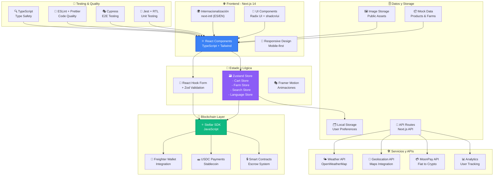

# Arquitectura Técnica del Sistema

Este diagrama muestra la arquitectura técnica completa del Revolutionary Farmers Marketplace, incluyendo frontend, backend, blockchain y servicios externos.

## Descripción de la Arquitectura

### 🌐 Frontend (Next.js 14)
- **Framework**: Next.js con App Router y Server Components
- **UI**: Combinación de TailwindCSS y Radix UI para componentes accesibles
- **Internacionalización**: Soporte completo para español e inglés
- **Responsive**: Design mobile-first con breakpoints optimizados

### 🔧 Estado y Gestión de Datos
- **Estado Global**: Zustand para gestión de estado ligera y eficiente
- **Formularios**: React Hook Form con validación Zod
- **Animaciones**: Framer Motion para transiciones fluidas

### 🔗 Integración Blockchain
- **Stellar Network**: SDK oficial para interacciones con la blockchain
- **Wallets**: Integración con Freighter y otros wallets Stellar
- **Payments**: Sistema de pagos en USDC stablecoin
- **Smart Contracts**: Sistema de escrow automatizado

### 🛠️ APIs y Servicios Externos
- **Clima**: Integración con OpenWeatherMap
- **Pagos**: MoonPay para conversión fiat-crypto
- **Analytics**: Seguimiento de métricas de usuario
- **Geolocalización**: APIs de mapas y ubicación

### 🧪 Testing y Calidad
- **Unit Testing**: Jest con React Testing Library
- **E2E Testing**: Cypress para pruebas de extremo a extremo
- **Code Quality**: ESLint, Prettier y TypeScript strict mode 