# Estructura de Componentes y Organización del Código

Este diagrama muestra la organización modular de componentes, páginas, stores y servicios en el Revolutionary Farmers Marketplace.

```mermaid
graph TB
    subgraph "📁 src/app/[locale]"
        A["🏠 page.tsx<br/>Página Principal"]
        B["🛒 marketplace/page.tsx<br/>Marketplace"]
        C["👨‍🌾 join-farmer/page.tsx<br/>Registro Agricultor"]
        D["🛒 cart/page.tsx<br/>Carrito"]
        E["💳 checkout/page.tsx<br/>Proceso de Pago"]
        F["📋 orders/page.tsx<br/>Historial Órdenes"]
        G["📍 address-book/page.tsx<br/>Libro Direcciones"]
        H["💰 invest/page.tsx<br/>Inversiones"]
    end
    
    subgraph "🧩 src/components"
        I["🎨 ui/<br/>Componentes Base"]
        J["🛒 cart/<br/>Carrito Components"]
        K["📦 products/<br/>Producto Components"]
        L["🏠 farm/<br/>Granja Components"]
        M["🔧 header/<br/>Header Components"]
        N["🦶 footer/<br/>Footer Components"]
        O["📱 marketplace/<br/>Marketplace Components"]
    end
    
    subgraph "🗃️ src/store"
        P["🛒 cartStore<br/>Estado del Carrito"]
        Q["🏠 farmStore<br/>Estado de Granjas"]
        R["🔍 searchStore<br/>Estado de Búsqueda"]
        S["🌍 languageStore<br/>Estado de Idioma"]
        T["👛 walletStore<br/>Estado de Wallet"]
    end
    
    subgraph "⚙️ src/services"
        U["🔒 escrow/<br/>Servicios Escrow"]
        V["🌤️ weather.ts<br/>Servicio del Clima"]
        W["🚀 deploy/<br/>Deploy Smart Contracts"]
    end
    
    A --> I
    B --> K
    B --> O
    C --> I
    D --> J
    E --> I
    F --> I
    G --> I
    H --> I
    
    J --> P
    K --> P
    K --> Q
    O --> R
    M --> S
    M --> T
    
    U --> T
    V --> Q
    W --> T
    
    style A fill:#e0e7ff,stroke:#6366f1,stroke-width:2px,color:#000
    style B fill:#fef3c7,stroke:#f59e0b,stroke-width:2px,color:#000
    style P fill:#dcfce7,stroke:#16a34a,stroke-width:2px,color:#000
    style U fill:#fed7aa,stroke:#ea580c,stroke-width:2px,color:#000
```

## Descripción de la Estructura

### 📁 Páginas (App Router)
- **Routing**: Basado en archivos con soporte para internacionalización
- **Layout**: Layout compartido con header, footer y navegación
- **Server Components**: Optimización SEO y performance
- **Dynamic Routes**: Rutas dinámicas para productos y granjas

### 🧩 Componentes Modulares
- **UI Base**: Componentes reutilizables con shadcn/ui
- **Domain Specific**: Componentes especializados por dominio
- **Composition**: Composición flexible de componentes
- **Accessibility**: Componentes accesibles con ARIA labels

### 🗃️ Estado Global (Zustand)
- **Cart Store**: Gestión del carrito de compras
- **Farm Store**: Estado de granjas y productos
- **Search Store**: Estado de búsquedas y filtros
- **Language Store**: Configuración de idioma
- **Wallet Store**: Estado de conexión blockchain

### ⚙️ Servicios y Lógica de Negocio
- **Escrow Services**: Operaciones de smart contracts
- **Weather Service**: Integración con APIs climáticas
- **Deploy Services**: Despliegue de contratos inteligentes

## Patrones de Arquitectura

### 🔄 Flujo de Datos
1. **Unidirectional**: Flujo de datos de arriba hacia abajo
2. **State Management**: Zustand para estado global compartido
3. **Local State**: useState para estado local de componentes
4. **Server State**: React Query para cacheo de datos de API

### 🏗️ Principios de Diseño
- **Separation of Concerns**: Separación clara entre UI, lógica y datos
- **Reusability**: Componentes reutilizables y modulares
- **Testability**: Estructura que facilita testing unitario e integración
- **Scalability**: Organización que permite crecimiento del proyecto 